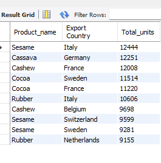
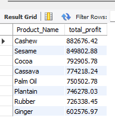

# NIGERIA-AGRICULTURAL-EXPORT(2021-2023)

---

### Project Overview : Analysing The Nigerian Agricultural Export (2021-2023)

This project focuses on analyzing Nigeria's agricultural exports, utilizing a dataset that captures detailed information on various products exported, the companies involved, and the financial metrics associated with these exports. The dataset contains crucial variables such as product names, export destinations, transportation modes, and economic figures like cost of goods sold (COGS), profit, and export value. By exploring this dataset, we aim to uncover insights into Nigeria's agricultural export patterns, identify key trends, and highlight areas for potential growth or improvement.

### Objectives
 **Analyze Export Patterns**:
   - To examine the patterns of agricultural exports from Nigeria, focusing on the frequency, volume, and types of products exported.
    
**Identify Key Export Destinations**:
   - To determine the major export destinations for Nigeria's agricultural products and analyze the trends in these markets over time.
     
**Evaluate Financial Performance**:
   - To assess the financial metrics associated with Nigeria's agricultural exports, including cost of goods sold (COGS), profit margins, and overall export value.
     
**Explore Transportation Modes**:
   - To investigate the different modes of transportation used for exporting agricultural products and their impact on export efficiency and cost.
     
**Spot Growth Opportunities**:
   - To identify potential areas for growth or improvement in Nigeria's agricultural export sector by analyzing trends and performance data.
     
**Company Performance Analysis**:
   - To evaluate the performance of companies involved in agricultural exports, focusing on their contribution to the overall export value and profitability.
     
**Recommendations**:
   - To provide actionable insights and recommendations based on the analysis of export trends, financial metrics, and market destinations.

## Tool
- MySQL
  
## Data Source
- Data-World

## Data Cleaning 
_Identifying and Understanding the Data_
- Reviewing the Dataset: Understanding the structure of the dataset
- Identifying Key Columns: This is to determine which columns are critical to the analysis, such as primary keys, foreign keys, and important metrics.

_Handling Duplicates_
- There were no duplicate data

_Handling Missing Data_
- There were no missing data
 
_Handling Outliers and Removing Irrelevant Data_
- There were no outliers as the data was a clean one

## Data Information
The dataset contains information on Nigeria's agricultural exports, including details about the products exported, the companies involved, and various financial metrics. 
- Number of Entries: 1,000 rows
- Number of Columns: 10

## **ANALYSIS ON EXPORT PATTERNS** 
**1. Frequency of Exports**
- To determine how frequently each product is exported
```
SELECT
    Product_Name,COUNT(*) AS Export_Frequency
FROM nigeria_agricultural_export
GROUP BY Product_Name
ORDER BY Export_Frequency DESC;

```
---

---

**2. Volume of Exports by Country**
- Identifying the top 10 product-country pairs with the highest export volumes in terms of units sold.

```
SELECT Product_name, `Export Country`, SUM(`Units Sold`) as Total_units
FROM credit.nigeria_agricultural_exports
GROUP BY `Export Country`,Product_name
ORDER BY total_units DESC;
```
---

---

**3. Volume of Exports by Country**
```
SELECT Product_Name, ROUND(SUM(Profit),2) as Total_profit
FROM credit.nigeria_agricultural_exports
GROUP BY Product_Name
ORDER BY total_profit DESC;
```
---

---


