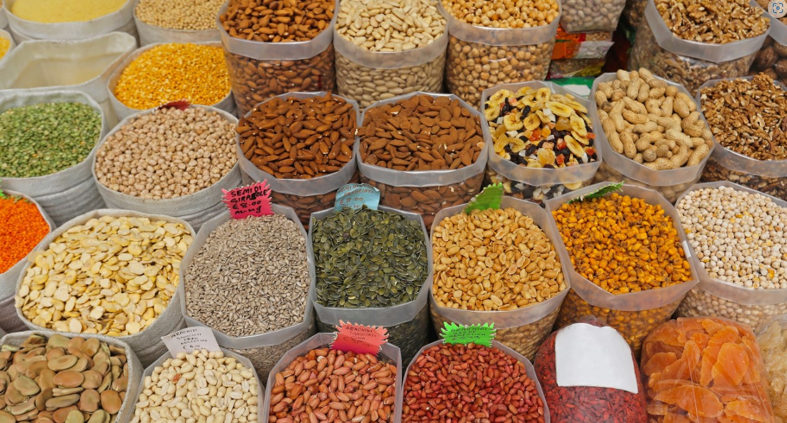
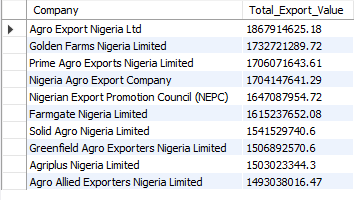

# NIGERIA-AGRICULTURAL-EXPORT(2021-2023)

---

### Project Overview : Analysing The Nigerian Agricultural Export (2021-2023)

This project focuses on analyzing Nigeria's agricultural exports, utilizing a dataset that captures detailed information on various products exported, the companies involved, and the financial metrics associated with these exports. The dataset contains crucial variables such as product names, export destinations, transportation modes, and economic figures like cost of goods sold (COGS), profit, and export value. By exploring this dataset, we aim to uncover insights into Nigeria's agricultural export patterns, identify key trends, and highlight areas for potential growth or improvement.

### Objectives
 **Analyze Export Patterns**:
   - To examine the patterns of agricultural exports from Nigeria, focusing on the frequency, volume, and types of products exported.
    
**Identify Key Export Destinations**:
   - To determine the major export destinations for Nigeria's agricultural products and analyze the trends in these markets over time.
     
**Evaluate Financial Performance**:
   - To assess the financial metrics associated with Nigeria's agricultural exports, including cost of goods sold (COGS), profit margins, and overall export value.
     
**Spot Growth Opportunities**:
   - Monitor and analyze performance trends over time(Montly Basis) 
     
**Company Performance Analysis**:
   - To evaluate the performance of companies involved in agricultural exports, focusing on their contribution to the overall export value and profitability.
     
**Recommendations**:
   - To provide actionable insights and recommendations based on the analysis of export trends, financial metrics, and market destinations.

## Tool
- MySQL

  
## About the Data
---

---
The dataset for this analysis comprises

**Product Name:** This contains different Products being shipped 

**Company:** This consists different companies names

**Export Country:** This is the lsit of countries products are being shipped into

**Date:** This is a Date table of period of (2021-2023)

**Unit Sold:** This consists of the total number product units sold 

**COGS:** This is the cost of goods sold

**Profits:** Total Profits made

**Exports Value:** This consists of the total monetary worth of goods or services sold by one country to another.

**Destination Port:** This is the ports where goods/cargo are delivered 

**Transportation Mode:** There was only a sible trasnport mode for this data

## Data Cleaning 
_Identifying and Understanding the Data_
- Reviewing the Dataset: Understanding the structure of the dataset
- Identifying Key Columns: This is to determine which columns are critical to the analysis, such as primary keys, foreign keys, and important metrics.

_Handling Duplicates_
- There were no duplicate data

_Handling Missing Data_
- There were no missing data
 
_Handling Outliers and Removing Irrelevant Data_
- There were no outliers as the data was a clean one

## Data Information
The dataset contains information on Nigeria's agricultural exports, including details about the products exported, the companies involved, and various financial metrics. 
- Number of Entries: 1,000 rows
- Number of Columns: 10

## Data Modelling

## **ANALYSIS ON EXPORT PATTERNS** 
**1. Frequency of Exports**
- To determine how frequently each product is exported
```
SELECT
    Product_Name,COUNT(*) AS Export_Frequency
FROM nigeria_agricultural_export
GROUP BY Product_Name
ORDER BY Export_Frequency DESC;

```
---

---

**2. Volume of Exports by Country**
- Identifying the top 10 product-country pairs with the highest export volumes in terms of units sold.

```
SELECT Product_name, `Export Country`, SUM(`Units Sold`) as Total_units
FROM credit.nigeria_agricultural_exports
GROUP BY `Export Country`,Product_name
ORDER BY total_units DESC
LIMIT 10;
```
---

---

**3 Most Exported Product**
- To Determine the Most Frequent product exported including their export Value
```
SELECT Product_Name, 
       SUM(`Export Value`) AS Total_Export_Value
FROM credit.nigeria_agricultural_exports
GROUP BY Product_Name
ORDER BY Total_Export_Value DESC;

```
---

---
**4. Major Export Destinations**
-Identify the top 10 countries with the highest total export values from Nigeria
```
SELECT `Export Country`, 
       SUM(`Export Value`) AS Total_Export_Value
FROM credit.nigeria_agricultural_exports
GROUP BY `Export Country`
ORDER BY Total_Export_Value DESC
LIMIT 10;  -- Top 10 export destinations
```
---

---


**5.Annual Financial Performance**
- Assessing the yearly financial performance of Nigeria's agricultural exports, including total export value, COGS, profit, and profit margin.
```
SELECT 
    YearlyData.Year,
    ROUND(SUM(YearlyData.Total_Export_Value), 2) AS Total_Export_Value,
    ROUND(SUM(YearlyData.Total_COGS), 2) AS Total_COGS,
    ROUND(SUM(YearlyData.Profit), 2) AS Profit,
    ROUND(
        (SUM(YearlyData.Profit) / NULLIF(SUM(YearlyData.Total_Export_Value), 0)) * 100,
        2
    ) AS Profit_Margin_Percentage
FROM (
    SELECT 
        YEAR(Date) AS Year,
        SUM(`Export Value`) AS Total_Export_Value,
        SUM(COGS) AS Total_COGS,
        SUM(`Export Value` - COGS) AS Profit
    FROM credit.nigeria_agricultural_exports
    GROUP BY YEAR(Date)
) AS YearlyData
GROUP BY YearlyData.Year

```
---

---

**6. Export Performance**
- Analyzing export trends and performance on a Monthly Basis
```
SELECT 
    Product_Name,
    YEAR(Date) AS Year,
    MONTH(Date) AS Month,
    MONTHNAME(Date) AS Month_Name,
    ROUND(SUM(`Export Value`), 2) AS Total_Export_Value
FROM credit.nigeria_agricultural_exports
GROUP BY 
    Product_Name, 
    YEAR(Date), 
    MONTH(Date), 
    MONTHNAME(Date)
ORDER BY 
    Product_Name, 
    Year, 
    Month;
```
---

---

**7. Company Performance Analysis**
- Determining the total export value contributed by each company
```
WITH AggregatedExportValues AS (
    SELECT 
        Company,
        ROUND(SUM(`Export Value`), 2) AS Total_Export_Value
    FROM credit.nigeria_agricultural_exports
    GROUP BY Company
),
FormattedExportValues AS (
    SELECT
        Company,
        Total_Export_Value
    FROM AggregatedExportValues
)
SELECT
    Company,
    Total_Export_Value
FROM FormattedExportValues
ORDER BY Total_Export_Value DESC;
```
---

---

- Rank of Companies Based on Profitabilty
```
WITH CompanyExportData AS (
    SELECT 
        Company,
        ROUND(SUM(`Export Value`), 2) AS Total_Export_Value,
        ROUND(SUM(COGS), 2) AS Total_COGS
    FROM credit.nigeria_agricultural_exports
    GROUP BY Company
),
CompanyProfitData AS (
    SELECT
        Company,
        Total_Export_Value,
        Total_COGS,
        ROUND(Total_Export_Value - Total_COGS, 2) AS Total_Profit
    FROM CompanyExportData
)
SELECT
    Company,
    Total_Export_Value,
    Total_Profit
FROM CompanyProfitData
ORDER BY Total_Profit DESC;
```
---

---
- Compare the performance of companies involved in agricultural exports on a monthly basis, focusing on their total export value and profitability.
```
WITH ExportData AS (
    SELECT 
        Company,
        YEAR(Date) AS Year,
        MONTH(Date) AS Numeric_Month,
        MONTHNAME(Date) AS Month_Name,
        ROUND(SUM(`Export Value`), 2) AS Total_Export_Value,
        ROUND(SUM(COGS), 2) AS Total_COGS
    FROM credit.nigeria_agricultural_exports
    GROUP BY Company, YEAR(Date), MONTH(Date)
),
ProfitData AS (
    SELECT
        Company,
        Year,
        Numeric_Month AS Month,
        Month_Name,
        Total_Export_Value,
        ROUND(Total_Export_Value - Total_COGS, 2) AS Total_Profit
    FROM ExportData
)
SELECT
    Company,
    Year,
    Month,
    Month_Name,
    Total_Export_Value,
    Total_Profit
FROM ProfitData
ORDER BY Company, Year, Month;
```
---

---

## FINDINGS AND RECOMMENDATION 
**Frequency of Exports**
1. **Cashew has the highest export frequency**:
   - With **139 exports**, Cashew is the most frequently exported product, indicating it may have a strong demand in international markets.

2. **Cocoa and Sesame follow closely**:
   - Cocoa (**136 exports**) and Sesame (**133 exports**) are also major exports, highlighting their importance in the export market, perhaps due to their value in the food and agriculture industries.

3. **Rubber and Palm Oil**:
   - Rubber (**125 exports**) and Palm Oil (**124 exports**) have relatively high export frequencies, suggesting significant trade activities in these sectors. Palm Oil, in particular, is known for its wide industrial use.

4. **Other notable exports**:
   - Plantain (**122 exports**) and Cassava (**120 exports**) are frequently exported, showing that staple agricultural products have a steady demand. Cassava, being a key food product, holds strong export potential.
   - Ginger (**101 exports**) rounds out the list, indicating a relatively high demand for this spice.

### Recommendations:

1. **Leverage Cashew’s Strong Market Position**:
   - Since Cashew has the highest export frequency, it would be beneficial to **invest in expanding its production and improving quality** to capture market demand further. Exploring new markets and building strategic trade partnerships could enhance export volume and profitability.

2. **Strengthen Cocoa and Sesame Export Infrastructure**:
   - Given their high export rates, **Cocoa and Sesame** should receive attention in ensuring quality control, exploring value-added processing (e.g., cocoa products), and improving the efficiency of the supply chain to meet growing demand.

3. **Diversify and Enhance Rubber and Palm Oil Exports**:
   - Both Rubber and Palm Oil have strong export frequencies. Initiatives like **certifications for sustainability** (especially in Palm Oil), investing in more eco-friendly production, and expanding into niche markets could improve their trade potential and profitability.

4. **Increase Focus on Plantain and Cassava Value Chains**:
   - With significant export demand, **Plantain and Cassava** could benefit from investment in **processing technology** (e.g., producing plantain chips, and cassava flour) to create more diversified products for the international market.

5. **Boost Ginger Exports through Product Differentiation**:
   - Given Ginger’s export frequency, the focus could be on **premium organic ginger production** or other forms such as **dried or processed ginger** to diversify offerings and appeal to more markets.

6. **Evaluate Market Demand and Explore New Opportunities**:
   - This report highlights current export patterns, but further analysis on **market demand trends** could help identify **emerging markets** or product lines that may become lucrative.

**Volume of Exports by Country**
### Findings:
1. **Sesame is the top exported product**:
   - Sesame has the highest export quantity, especially to **Italy** with **12,444 units**. This suggests a strong demand for Sesame in European countries.

2. **Cassava’s high export to Germany**:
   - Cassava is primarily exported to **Germany** with **12,251 units**, indicating that it plays a significant role in the agricultural export market and is highly valued in Europe.

3. **Cashew has a strong presence in France and Belgium**:
   - Cashew exports to **France** account for **12,008 units**, making it a major destination. Additionally, **Belgium** imports **9,698 units** of Cashews, highlighting the importance of Cashew in the European market.

4. **Cocoa exports show strong demand in Europe**:
   - **Sweden** imported **11,514 units** of Cocoa, while **France** received **11,220 units**. This showcases a robust European market for Cocoa, possibly due to the demand for chocolate and related products.

5. **Rubber’s significant demand in Italy and the Netherlands**:
   - **Italy** imports **10,606 units** of Rubber, and **9,155 units** go to the **Netherlands**. This reflects Europe's continued industrial demand for Rubber, likely for automotive and manufacturing uses.

6. **Switzerland and Sweden are key markets for Sesame**:
   - Switzerland imports **9,599 units**, and Sweden takes **9,281 units** of Sesame, further reinforcing the dominance of this product in European markets.

### Recommendations:

1. **Capitalize on the Strong Demand for Sesame**:
   - With **Sesame** being a leading export to multiple European countries, further investment in **scaling up production** and ensuring **consistent quality** could help maintain and expand market share. **Targeting new markets** in Europe, as well as improving distribution networks, could enhance export volumes.

2. **Leverage Cassava’s Popularity in Germany**:
   - The strong demand for **Cassava** in **Germany** suggests potential growth in the region. Further investment in **Cassava processing** (e.g., flour, chips) could help diversify product offerings and increase value-added exports.

3. **Increase Cashew Exports to France and Belgium**:
   - Since **Cashew** exports are already prominent in **France** and **Belgium**, these markets could be further expanded by **introducing value-added cashew products** (e.g., roasted or packaged nuts). A marketing campaign focused on the health benefits of Cashews might further boost demand.

4. **Boost Cocoa Exports by Exploring Value-Added Products**:
   - Given the high demand for **Cocoa** in **Sweden** and **France**, focusing on **cocoa-based products** (e.g., processed chocolate or cocoa butter) may lead to higher returns. Ensuring sustainability certifications (e.g., fair-trade cocoa) might also increase appeal in European markets where ethical sourcing is valued.

5. **Strengthen Rubber Exports to Italy and the Netherlands**:
   - With **Rubber** being a significant export to these countries, further investment in **rubber plantations** or **industrial partnerships** in Europe could increase sales. Focus on supplying **eco-friendly and sustainable rubber products** could help expand the market in countries with strong environmental regulations.

6. **Expand Sesame Exports to Other European Markets**:
   - Since **Switzerland** and **Sweden** are already importing large quantities of Sesame, there's an opportunity to explore other European countries with rising demand for healthy foods and seeds. Expanding distribution to countries like **Germany** and **Spain** could help broaden the customer base.

By addressing these key insights, the company can continue strengthening its export portfolio and improve profitability by focusing on product quality, market expansion, and value-added processing.

**Most Exported Product**
### Findings:
1. **Cocoa** leads in export value at **$238.49M**, followed by **Sesame** at **$226.86M**, showing high demand.
2. **Rubber** and **Cashew** contribute significantly, each exceeding **$211M** in export value.
3. **Palm Oil** and **Plantain** exports stand strong at **$197M** and **$194M** respectively.
4. **Cassava** and **Ginger** have notable export values, **$191M** and **$160M**, but are slightly lower compared to others.

### Recommendations:
1. **Invest in Cocoa**: Expand production and value-added products like chocolate to boost revenue.
2. **Enhance Sesame Supply**: Strengthen supply chains and target new markets in Asia and the Middle East.
3. **Optimize Rubber and Cashew**: Explore partnerships and focus on processed products for increased profitability.
4. **Promote Sustainable Palm Oil**: Adopt sustainability certifications to tap into new markets.
5. **Boost Cassava and Plantain Exports**: Explore processing opportunities and expand into regions with rising demand.
6. **Expand Ginger Market**: Target premium markets and promote health benefits for a higher value.

This approach ensures continued growth by maximizing key export products and tapping into new markets.

**Major Export Destinations**


