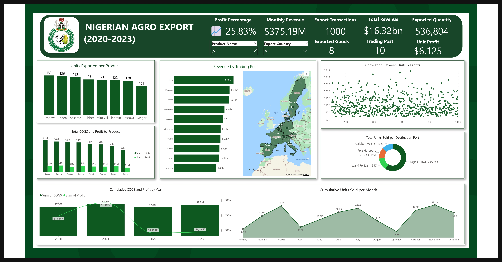

# NIGERIA-AGRICULTURAL-EXPORT(2021-2023)

---

### Project Overview : Analysing The Nigerian Agricultural Export (2021-2023)

This project focuses on analyzing Nigeria's agricultural exports, utilizing a dataset that captures detailed information on various products exported, the companies involved, and the financial metrics associated with these exports. The dataset contains crucial variables such as product names, export destinations, transportation modes, and economic figures like cost of goods sold (COGS), profit, and export value. By exploring this dataset, we aim to uncover insights into Nigeria's agricultural export patterns, identify key trends, and highlight areas for potential growth or improvement.

### Objectives
 **Analyze Export Patterns**:
   - To examine the patterns of agricultural exports from Nigeria, focusing on the frequency, volume, and types of products exported.
    
**Identify Key Export Destinations**:
   - To determine the major export destinations for Nigeria's agricultural products and analyze the trends in these markets over time.
     
**Evaluate Financial Performance**:
   - To assess the financial metrics associated with Nigeria's agricultural exports, including cost of goods sold (COGS), profit margins, and overall export value.
     
**Spot Growth Opportunities**:
   - Monitor and analyze performance trends over time(Montly Basis) 
     
**Company Performance Analysis**:
   - To evaluate the performance of companies involved in agricultural exports, focusing on their contribution to the overall export value and profitability.
     
**Recommendations**:
   - To provide actionable insights and recommendations based on the analysis of export trends, financial metrics, and market destinations.

## Tool
- MySQL,Power BI

  
## About the Data
---

---
The dataset for this analysis comprises

**Product Name:** This contains different Products being shipped 

**Company:** This consists different companies names

**Export Country:** This is the lsit of countries products are being shipped into

**Date:** This is a Date table of period of (2021-2023)

**Unit Sold:** This consists of the total number product units sold 

**COGS:** This is the cost of goods sold

**Profits:** Total Profits made

**Exports Value:** This consists of the total monetary worth of goods or services sold by one country to another.

**Destination Port:** This is the ports where goods/cargo are delivered 

**Transportation Mode:** There was only a sible trasnport mode for this data

## Data Cleaning 
_Identifying and Understanding the Data_
- Reviewing the Dataset: Understanding the structure of the dataset
- Identifying Key Columns: This is to determine which columns are critical to the analysis, such as primary keys, foreign keys, and important metrics.

_Handling Duplicates_
- There were no duplicate data

_Handling Missing Data_
- There were no missing data
 
_Handling Outliers and Removing Irrelevant Data_
- There were no outliers as the data was a clean one

## Data Information
The dataset contains information on Nigeria's agricultural exports, including details about the products exported, the companies involved, and various financial metrics. 
- Number of Entries: 1,000 rows
- Number of Columns: 10

## Data Modelling

## **ANALYSIS ON EXPORT PATTERNS** 
**1. Frequency of Exports**
- To determine how frequently each product is exported
```
SELECT
    Product_Name,COUNT(*) AS Export_Frequency
FROM nigeria_agricultural_export
GROUP BY Product_Name
ORDER BY Export_Frequency DESC;

```
---

---

**2. Volume of Exports by Country**
- Identifying the top 10 product-country pairs with the highest export volumes in terms of units sold.

```
SELECT Product_name, `Export Country`, SUM(`Units Sold`) as Total_units
FROM credit.nigeria_agricultural_exports
GROUP BY `Export Country`,Product_name
ORDER BY total_units DESC
LIMIT 10;
```
---

---

**3 Most Exported Product**
- To Determine the Most Frequent product exported including their export Value
```
SELECT Product_Name, 
       SUM(`Export Value`) AS Total_Export_Value
FROM credit.nigeria_agricultural_exports
GROUP BY Product_Name
ORDER BY Total_Export_Value DESC;

```
---

---
**4. Major Export Destinations**
-Identify the top 10 countries with the highest total export values from Nigeria
```
SELECT `Export Country`, 
       SUM(`Export Value`) AS Total_Export_Value
FROM credit.nigeria_agricultural_exports
GROUP BY `Export Country`
ORDER BY Total_Export_Value DESC
LIMIT 10;  -- Top 10 export destinations
```
---

---


**5.Annual Financial Performance**
- Assessing the yearly financial performance of Nigeria's agricultural exports, including total export value, COGS, profit, and profit margin.
```
SELECT 
    YearlyData.Year,
    ROUND(SUM(YearlyData.Total_Export_Value), 2) AS Total_Export_Value,
    ROUND(SUM(YearlyData.Total_COGS), 2) AS Total_COGS,
    ROUND(SUM(YearlyData.Profit), 2) AS Profit,
    ROUND(
        (SUM(YearlyData.Profit) / NULLIF(SUM(YearlyData.Total_Export_Value), 0)) * 100,
        2
    ) AS Profit_Margin_Percentage
FROM (
    SELECT 
        YEAR(Date) AS Year,
        SUM(`Export Value`) AS Total_Export_Value,
        SUM(COGS) AS Total_COGS,
        SUM(`Export Value` - COGS) AS Profit
    FROM credit.nigeria_agricultural_exports
    GROUP BY YEAR(Date)
) AS YearlyData
GROUP BY YearlyData.Year

```
---

---

**6. Export Performance**
- Analyzing export trends and performance on a Monthly Basis
```
SELECT 
    Product_Name,
    YEAR(Date) AS Year,
    MONTH(Date) AS Month,
    MONTHNAME(Date) AS Month_Name,
    ROUND(SUM(`Export Value`), 2) AS Total_Export_Value
FROM credit.nigeria_agricultural_exports
GROUP BY 
    Product_Name, 
    YEAR(Date), 
    MONTH(Date), 
    MONTHNAME(Date)
ORDER BY 
    Product_Name, 
    Year, 
    Month;
```
---

---

**7. Company Performance Analysis**
- Determining the total export value contributed by each company
```
WITH AggregatedExportValues AS (
    SELECT 
        Company,
        ROUND(SUM(`Export Value`), 2) AS Total_Export_Value
    FROM credit.nigeria_agricultural_exports
    GROUP BY Company
),
FormattedExportValues AS (
    SELECT
        Company,
        Total_Export_Value
    FROM AggregatedExportValues
)
SELECT
    Company,
    Total_Export_Value
FROM FormattedExportValues
ORDER BY Total_Export_Value DESC;
```
---

---

- Rank of Companies Based on Profitabilty
```
WITH CompanyExportData AS (
    SELECT 
        Company,
        ROUND(SUM(`Export Value`), 2) AS Total_Export_Value,
        ROUND(SUM(COGS), 2) AS Total_COGS
    FROM credit.nigeria_agricultural_exports
    GROUP BY Company
),
CompanyProfitData AS (
    SELECT
        Company,
        Total_Export_Value,
        Total_COGS,
        ROUND(Total_Export_Value - Total_COGS, 2) AS Total_Profit
    FROM CompanyExportData
)
SELECT
    Company,
    Total_Export_Value,
    Total_Profit
FROM CompanyProfitData
ORDER BY Total_Profit DESC;
```
---

---
- Compare the performance of companies involved in agricultural exports on a monthly basis, focusing on their total export value and profitability.
```
WITH ExportData AS (
    SELECT 
        Company,
        YEAR(Date) AS Year,
        MONTH(Date) AS Numeric_Month,
        MONTHNAME(Date) AS Month_Name,
        ROUND(SUM(`Export Value`), 2) AS Total_Export_Value,
        ROUND(SUM(COGS), 2) AS Total_COGS
    FROM credit.nigeria_agricultural_exports
    GROUP BY Company, YEAR(Date), MONTH(Date)
),
ProfitData AS (
    SELECT
        Company,
        Year,
        Numeric_Month AS Month,
        Month_Name,
        Total_Export_Value,
        ROUND(Total_Export_Value - Total_COGS, 2) AS Total_Profit
    FROM ExportData
)
SELECT
    Company,
    Year,
    Month,
    Month_Name,
    Total_Export_Value,
    Total_Profit
FROM ProfitData
ORDER BY Company, Year, Month;
```
---

---

## DASHBAORD
---

---

## FINDINGS AND RECOMMENDATION 
## _Frequency of Exports_
1. **Cashew has the highest export frequency**:
   - With **139 exports**, Cashew is the most frequently exported product, indicating it may have a strong demand in international markets.

2. **Cocoa and Sesame follow closely**:
   - Cocoa (**136 exports**) and Sesame (**133 exports**) are also major exports, highlighting their importance in the export market, perhaps due to their value in the food and agriculture industries.

3. **Rubber and Palm Oil**:
   - Rubber (**125 exports**) and Palm Oil (**124 exports**) have relatively high export frequencies, suggesting significant trade activities in these sectors. Palm Oil, in particular, is known for its wide industrial use.

4. **Other notable exports**:
   - Plantain (**122 exports**) and Cassava (**120 exports**) are frequently exported, showing that staple agricultural products have a steady demand. Cassava, being a key food product, holds strong export potential.
   - Ginger (**101 exports**) rounds out the list, indicating a relatively high demand for this spice.

### Recommendations:

1. **Leverage Cashew’s Strong Market Position**:
   - Since Cashew has the highest export frequency, it would be beneficial to **invest in expanding its production and improving quality** to capture market demand further. Exploring new markets and building strategic trade partnerships could enhance export volume and profitability.

2. **Strengthen Cocoa and Sesame Export Infrastructure**:
   - Given their high export rates, **Cocoa and Sesame** should receive attention in ensuring quality control, exploring value-added processing (e.g., cocoa products), and improving the efficiency of the supply chain to meet growing demand.

3. **Diversify and Enhance Rubber and Palm Oil Exports**:
   - Both Rubber and Palm Oil have strong export frequencies. Initiatives like **certifications for sustainability** (especially in Palm Oil), investing in more eco-friendly production, and expanding into niche markets could improve their trade potential and profitability.

4. **Increase Focus on Plantain and Cassava Value Chains**:
   - With significant export demand, **Plantain and Cassava** could benefit from investment in **processing technology** (e.g., producing plantain chips, and cassava flour) to create more diversified products for the international market.

5. **Boost Ginger Exports through Product Differentiation**:
   - Given Ginger’s export frequency, the focus could be on **premium organic ginger production** or other forms such as **dried or processed ginger** to diversify offerings and appeal to more markets.

6. **Evaluate Market Demand and Explore New Opportunities**:
   - This report highlights current export patterns, but further analysis on **market demand trends** could help identify **emerging markets** or product lines that may become lucrative.

## _Volume of Exports by Country_
### Findings:
1. **Sesame is the top exported product**:
   - Sesame has the highest export quantity, especially to **Italy** with **12,444 units**. This suggests a strong demand for Sesame in European countries.

2. **Cassava’s high export to Germany**:
   - Cassava is primarily exported to **Germany** with **12,251 units**, indicating that it plays a significant role in the agricultural export market and is highly valued in Europe.

3. **Cashew has a strong presence in France and Belgium**:
   - Cashew exports to **France** account for **12,008 units**, making it a major destination. Additionally, **Belgium** imports **9,698 units** of Cashews, highlighting the importance of Cashew in the European market.

4. **Cocoa exports show strong demand in Europe**:
   - **Sweden** imported **11,514 units** of Cocoa, while **France** received **11,220 units**. This showcases a robust European market for Cocoa, possibly due to the demand for chocolate and related products.

5. **Rubber’s significant demand in Italy and the Netherlands**:
   - **Italy** imports **10,606 units** of Rubber, and **9,155 units** go to the **Netherlands**. This reflects Europe's continued industrial demand for Rubber, likely for automotive and manufacturing uses.

6. **Switzerland and Sweden are key markets for Sesame**:
   - Switzerland imports **9,599 units**, and Sweden takes **9,281 units** of Sesame, further reinforcing the dominance of this product in European markets.

### Recommendations:

1. **Capitalize on the Strong Demand for Sesame**:
   - With **Sesame** being a leading export to multiple European countries, further investment in **scaling up production** and ensuring **consistent quality** could help maintain and expand market share. **Targeting new markets** in Europe, as well as improving distribution networks, could enhance export volumes.

2. **Leverage Cassava’s Popularity in Germany**:
   - The strong demand for **Cassava** in **Germany** suggests potential growth in the region. Further investment in **Cassava processing** (e.g., flour, chips) could help diversify product offerings and increase value-added exports.

3. **Increase Cashew Exports to France and Belgium**:
   - Since **Cashew** exports are already prominent in **France** and **Belgium**, these markets could be further expanded by **introducing value-added cashew products** (e.g., roasted or packaged nuts). A marketing campaign focused on the health benefits of Cashews might further boost demand.

4. **Boost Cocoa Exports by Exploring Value-Added Products**:
   - Given the high demand for **Cocoa** in **Sweden** and **France**, focusing on **cocoa-based products** (e.g., processed chocolate or cocoa butter) may lead to higher returns. Ensuring sustainability certifications (e.g., fair-trade cocoa) might also increase appeal in European markets where ethical sourcing is valued.

5. **Strengthen Rubber Exports to Italy and the Netherlands**:
   - With **Rubber** being a significant export to these countries, further investment in **rubber plantations** or **industrial partnerships** in Europe could increase sales. Focus on supplying **eco-friendly and sustainable rubber products** could help expand the market in countries with strong environmental regulations.

6. **Expand Sesame Exports to Other European Markets**:
   - Since **Switzerland** and **Sweden** are already importing large quantities of Sesame, there's an opportunity to explore other European countries with rising demand for healthy foods and seeds. Expanding distribution to countries like **Germany** and **Spain** could help broaden the customer base.

By addressing these key insights, the company can continue strengthening its export portfolio and improve profitability by focusing on product quality, market expansion, and value-added processing.

## _Most Exported Product_
### Findings:
1. **Cocoa** leads in export value at **$238.49M**, followed by **Sesame** at **$226.86M**, showing high demand.
2. **Rubber** and **Cashew** contribute significantly, each exceeding **$211M** in export value.
3. **Palm Oil** and **Plantain** exports stand strong at **$197M** and **$194M** respectively.
4. **Cassava** and **Ginger** have notable export values, **$191M** and **$160M**, but are slightly lower compared to others.

### Recommendations:
1. **Invest in Cocoa**: Expand production and value-added products like chocolate to boost revenue.
2. **Enhance Sesame Supply**: Strengthen supply chains and target new markets in Asia and the Middle East.
3. **Optimize Rubber and Cashew**: Explore partnerships and focus on processed products for increased profitability.
4. **Promote Sustainable Palm Oil**: Adopt sustainability certifications to tap into new markets.
5. **Boost Cassava and Plantain Exports**: Explore processing opportunities and expand into regions with rising demand.
6. **Expand Ginger Market**: Target premium markets and promote health benefits for a higher value.

This approach ensures continued growth by maximizing key export products and tapping into new markets.

## _Major Export Destinations_
### Findings:
1. **Top Exporters**:
   - **Italy** has the highest export value at 19.6 billion.
   - **Denmark** and **France** follow closely, with 18.3 billion and 18.0 billion, respectively.
   
2. **Moderate Exporters**:
   - Countries like **Switzerland**, **Belgium**, **Netherlands**, **Austria**, and **Sweden** fall into a mid-range export category, with values between 15.3 billion and 16.6 billion.
   
3. **Lowest Exporters in the List**:
   - **Spain** and **Germany** have the lowest export values, around 14.8 billion and 13.9 billion, respectively.

### Recommendations:
1. **Focus on Italy**: Since Italy has the highest export value, it would be beneficial to analyze what products or services contribute most to this and explore ways to replicate these strategies in other countries.
   
2. **Leverage Denmark and France**: These countries are performing well. Consider building on these markets by increasing the scope or improving efficiency in export channels.
   
3. **Improve Germany’s Position**: Germany, being traditionally known for strong exports, ranks last in this dataset. It may be useful to investigate potential barriers (e.g., trade policies, economic conditions) that are limiting its performance.

4. **Optimize Across the Middle Range**: The countries in the middle range (Switzerland, Belgium, Netherlands, Austria, Sweden) have room for growth. Further market analysis could help identify new export opportunities or sectors needing support.

## _Annual Financial Performance_


### Findings:

1. **Steady Growth in Total Export Value**:
   - The export value has consistently increased from **377.6 billion** in 2020 to **418.7 billion** in 2023. This indicates strong growth in export activities.
   
2. **Consistently High Profit Margins**:
   - The profit margin percentage remains consistently high across all years, hovering around **99.81% to 99.82%**. This suggests extremely efficient cost management and high profitability.
   
3. **Increasing Profit**:
   - Profit has shown a steady increase, rising from **376.9 billion** in 2020 to **413.0 billion** in 2023, which reflects the positive impact of growing export value on profitability.

4. **Low COGS**:
   - The cost of goods sold (COGS) is consistently low in comparison to the total export value, contributing to high-profit margins. For instance, in 2023, COGS is only **7.7 million**, while the profit exceeds **413 billion**.

### Recommendations:

1. **Leverage Current Profitability**:
   - With a profit margin nearing 100%, the business should capitalize on this high profitability by reinvesting profits in expanding export operations, exploring new markets, or diversifying product offerings.
   
2. **Ensure Sustainability**:
   - While the current profitability and growth are impressive, it is important to evaluate whether these trends are sustainable in the long term. A detailed analysis of market trends, competition, and potential risks (e.g., rising production costs, and political instability) would help maintain this strong performance.
   
3. **Explore Cost Optimization**:
   - Even with low COGS, there may be opportunities to reduce costs further by optimizing supply chains or renegotiating supplier contracts to maintain competitiveness in case of future challenges.
   
4. **Future-Proofing the Business**:
   - Given the continuous increase in export value and profits, future-proofing the business by investing in technology (e.g., automation, digital platforms) could sustain operational efficiency and profitability over the long term.

## _Export Performance_
### Findings:

1. **Fluctuating Export Values in 2020**:
   - The total export value fluctuated significantly from month to month. For instance, January 2020 had a relatively low export value of **7.01 million**, while December peaked at **383.6 million**.
   
2. **Seasonal Trends**:
   - There appears to be a strong seasonal trend in exports, with the lowest values occurring early in the year (January, February) and higher peaks towards the end of the year (October to December).
   - Notable peaks occurred in **April (150.0 million)**, **October (651.5 million)**, and **December (383.6 million)**, possibly reflecting seasonal harvesting or market demand cycles.
   
3. **2021 Starting Slower**:
   - Data for early 2021 shows a slower start compared to 2020. January 2021 recorded an export value of **46.2 million**, which is a marked decrease from December 2020. However, February and March 2021 show recovery with values of **51.7 million** and **47.5 million**, respectively.
   
4. **High Export in Specific Months**:
   - **October 2020** had the highest export value in the dataset at **651.5 million**, followed by **December 2020** with **383.6 million**. This suggests that the final quarter of the year could be the most lucrative period for cashew exports.

### Recommendations:

1. **Leverage Seasonal Peaks**:
   - The clear seasonal trend suggests the company should focus on maximizing output and market presence during high-demand periods (e.g., October to December). This could involve ramping up production, optimizing logistics, and securing larger contracts in these months to capitalize on higher demand.
   
2. **Investigate Low-Performing Months**:
   - The dip in export values early in the year (January and February) warrants attention. The company could explore strategies such as diversifying export markets or promoting off-season products to maintain more consistent revenue throughout the year.
   
3. **Strengthen Forecasting and Inventory Management**:
   - Given the fluctuations, better forecasting tools may help manage production and exports, ensuring that supply can meet demand during peak months while minimizing oversupply during slower periods.
   
4. **Expand Marketing Efforts in Early 2021**:
   - The slower start in 2021 compared to 2020 could be due to external factors (e.g., market conditions or supply chain disruptions). Increasing marketing efforts or adjusting pricing strategies might help recover momentum and boost early-year exports.

5. **Monitor External Factors**:
   - Changes in the global market, political or economic factors, or changes in cashew demand could explain some of the fluctuations. A broader analysis of external influences should guide future strategy adjustments.

## _Company Performance Analysis_

### Findings 

1. **Top Exporting Companies**: 
   The first image lists companies based on their export values, with **Agro Export Nigeria Ltd** leading at 186.79 billion in total export value and a matching total profit of 186.47 billion. Other key players include **Golden Farms Nigeria Limited** and **Prime Agro Exports Nigeria Limited**, also have significant contributions to both export value and profit.

2. **Profitability**: 
   Most companies listed show total profit values very close to their total export values, suggesting a high profit margin or efficiency in their export operations. For instance, the profit of **Prime Agro Exports Nigeria Limited** almost mirrors their export value, which indicates effective cost management and revenue generation.

3. **Nigerian Export Promotion Council (NEPC)**: 
   The **NEPC** is a notable presence on the list with an export value of around 164 billion but does not have reported profit values, which suggests it might be a regulatory or promotional body rather than a revenue-focused entity.

4. **Range of Export Values**:
   Export values across companies range from 186 billion down to 149 billion, which highlights the competitiveness of these top-tier companies. However, the difference between the highest and lowest performers is not drastically large, indicating similar market shares among these key players.

5. **Slight Variances in Reporting**:
   The second table displays only the **Total Export Value** without the profit values. This might be a filtered or partial view of the report, focusing solely on export performance without diving into profitability metrics.

### Recommendations:

1. **Further Analysis on Profit Margins**:
   A deeper analysis of the cost structures of these companies should be performed. The fact that their profit values closely mirror their export values suggests either optimized operations or hidden inefficiencies. Understanding the underlying cost can guide policy or business decisions.

2. **Investigate the Role of NEPC**:
   Since NEPC appears on the list but with no profit data, it would be beneficial to investigate its exact role in the export market. If NEPC is a facilitator or regulator, its impact on the overall export industry should be measured to assess whether it helps boost other companies' exports.

3. **Benchmarking Best Performers**:
   Companies like **Agro Export Nigeria Ltd** and **Golden Farms Nigeria Limited** could serve as case studies to understand their successful strategies in both exports and profitability. This benchmarking can provide insights into best practices in the export sector.

4. **Segment Profit and Export Data**:
   It would be beneficial to segment this data further by export product type or geographical region to understand better which sectors are driving these export values. Insights on the diversification of exports and market focus could be generated from this segmentation.

5. **Longitudinal Study**:
   If possible, examine these export and profit values over time to identify trends and forecast future performance. Identifying whether these companies have been growing or plateauing will guide strategic decisions for stakeholders.


